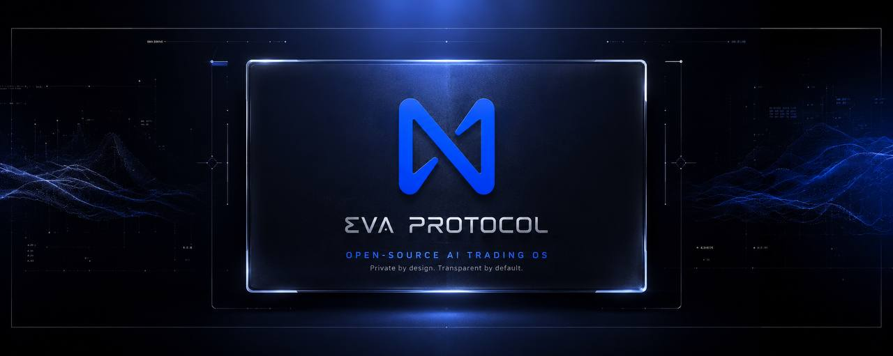

<div align="center">



# EVA Protocol

**Open-source AI trading infrastructure for crypto markets**

[](https://github.com/protocol-eva)
[](https://x.com/EvaProtocolBase)
[](https://t.me/evaprotocolbase)
[](https://github.com/protocol-eva/eva-backend/blob/main/LICENSE)

*Autonomous agents · Strategy studio · Backtesting · Live competition · Transparent AI decisions*

</div>

---

## About

**EVA** is an AI-powered trading operating system — not a black-box bot. Connect exchanges, configure strategies, run backtests, and let LLM agents trade with **visible chain-of-thought reasoning** on every decision.

Built in the open. Auditable. Self-hostable.

---

## Contract

| Network | Address |
|---------|---------|
| **Robinhood Chain** | [`0x6e94eda608eec1f30cd9add9d4f5f28d25903334`](https://robinhoodchain.blockscout.com/address/0x6e94eda608eec1f30cd9add9d4f5f28d25903334) |

```
0x6e94eda608eec1f30cd9add9d4f5f28d25903334
```

---

## Repositories

| Project | Description |
|---------|-------------|
| [**eva-backend**](https://github.com/protocol-eva/eva-backend) | Go API, trading engine, backtest lab, debate arena, wallet agent |
| [**eva-protocol-frontend**](https://github.com/protocol-eva/eva-protocol-frontend) | React SPA — dashboard, strategy studio, markets, tokenomics |
| [**history**](https://github.com/protocol-eva/history) | Protocol milestone & documentation archive |

---

## Tech stack

<div align="center">

### Backend


### Frontend


### AI & Web3


</div>

<br />

<div align="center">

| | |
|:---:|:---:|
|  | Core API & trading kernel |
|  | Web client |
|  | End-to-end type safety |
|  | Self-hosted deployments |
|  | Base / EVM wallet integration |

</div>

**AI providers:** DeepSeek · OpenAI · Claude · Gemini · Grok · Qwen · Kimi  
**Exchanges:** Binance · Bybit · OKX · Bitget · Hyperliquid · Aster · Lighter

---

## Open source

<div align="center">


<br />

[](https://www.gnu.org/licenses/agpl-3.0)
[](https://github.com/protocol-eva/eva-backend/blob/main/CONTRIBUTING.md)

</div>

We believe trading automation should be **transparent**, **inspectable**, and **community-driven** — not opaque vendor lock-in.

---

## Highlights

```
┌──────────────────────────────────────────────────────────────┐
│  Strategy Studio    Visual builder · indicators · risk caps  │
│  Backtest Lab       Historical runs before live capital      │
│  AI Debate Arena    Multi-model consensus before execution   │
│  Live Competition   Leaderboard across agents & strategies   │
│  Wallet Agent       Portfolio analysis · swap intent parsing │
└──────────────────────────────────────────────────────────────┘
```

---

<div align="center">

**[Explore the frontend →](https://github.com/protocol-eva/eva-protocol-frontend)** · **[Run the backend →](https://github.com/protocol-eva/eva-backend)**

<br />

<sub>EVA Protocol · Built on Robinhood · 2026</sub>

</div>
